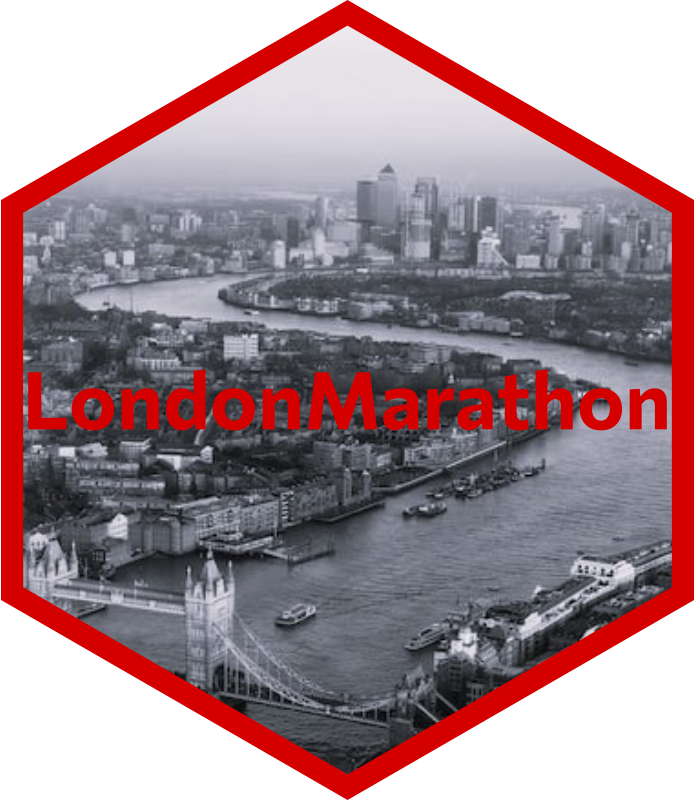
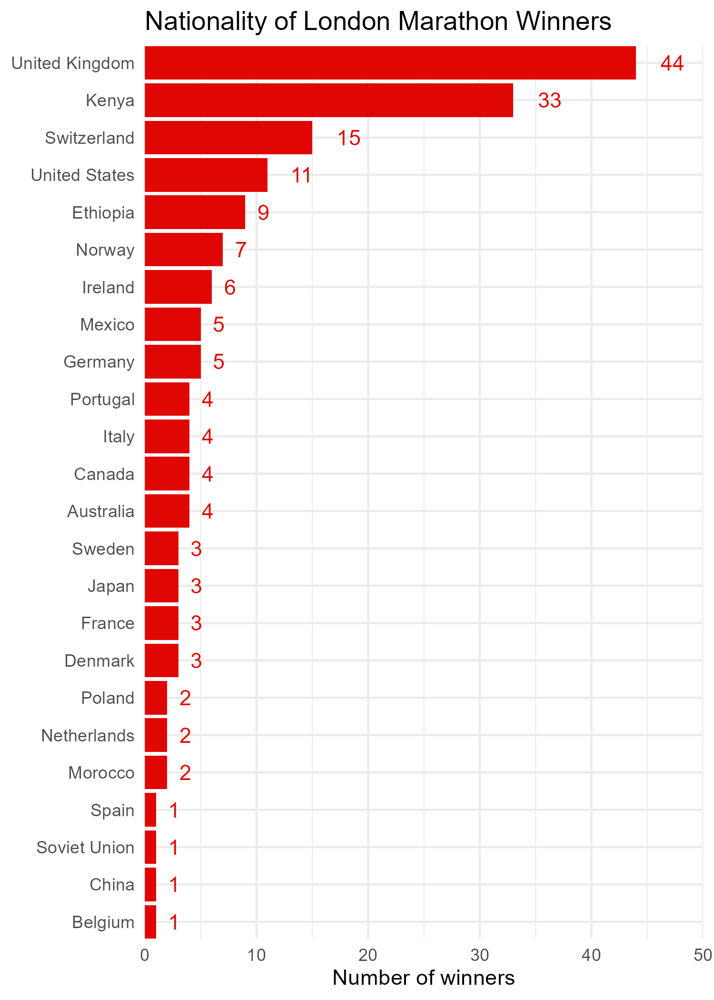
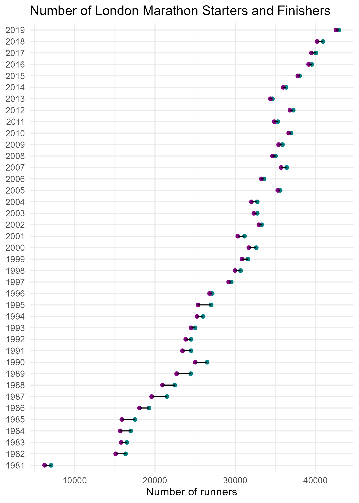

<!-- badges: start -->
  [](https://github.com/nrennie/LondonMarathon/actions)
<!-- badges: end -->

# LondonMarathon 

An R package containing two data sets scraped from Wikipedia (last scraped 6 April 2025) on London Marathon winners, and general data. The two data sets can be joined by `Year`.

## Installation

Install using:

```
remotes::install_github("nrennie/LondonMarathon")
```
Load the data sets with:

```
data(winners, package = "LondonMarathon")
data(london_marathon, package = "LondonMarathon")
```

> To make it easier to work with the `Time` column in the `winners` date, we suggest also installing the `chron` package. If not installed, the times will be displayed as a decimal (representing the fraction of 24 hours).

## Data dictionaries

### `winners`

|Column       |Class      |Description                |Example              |
|:------------|:----------|:--------------------------|:--------------------|
|Category     |character  |Category of race           |Men                  |
|Year         |integer    |Year                       |1981                 |
|Athlete      |character  |Name of the winner         |Dick Beardsley (Tie) |
|Nationality  |character  |Nationality of the winner  |United States        |
|Time         |character  |Winning time               |02:11:48             |


### `london_marathon`

|Column           |Class      |Description                                 |Example              |
|:----------------|:----------|:-------------------------------------------|:--------------------|
|Date             |character  |Date of the race                            |1981-03-29           |
|Year             |integer    |Year                                        |1981                 |
|Applicants       |integer    |Number of people who applied                |20000                |
|Accepted         |integer    |Number of people accepted                   |7747                 |
|Starters         |integer    |Number of people who started                |7055                 |
|Finishers        |integer    |Number of people who finished               |6255                 |
|Raised           |integer    |Amount raised for charity (£ millions)      |46.5                 |
|Official.charity |character  |Official charity                            |SportsAid            |

Note: If there are multiple official charity partners in a given year, these are separated with a `;`. There are currently a few issues with some oddly formatted charity names in the raw data, and these are currently represented by `NA`.

## Plots

<p align="center">
  
  
</p>

See the code in `inst/plots.R` to create these example plots.

## Hex Sticker

The background photo in the hex sticker is from [Benjamin Davies](https://unsplash.com/@bendavisual) on [Unsplash](https://unsplash.com/photos/Oja2ty_9ZLM).
